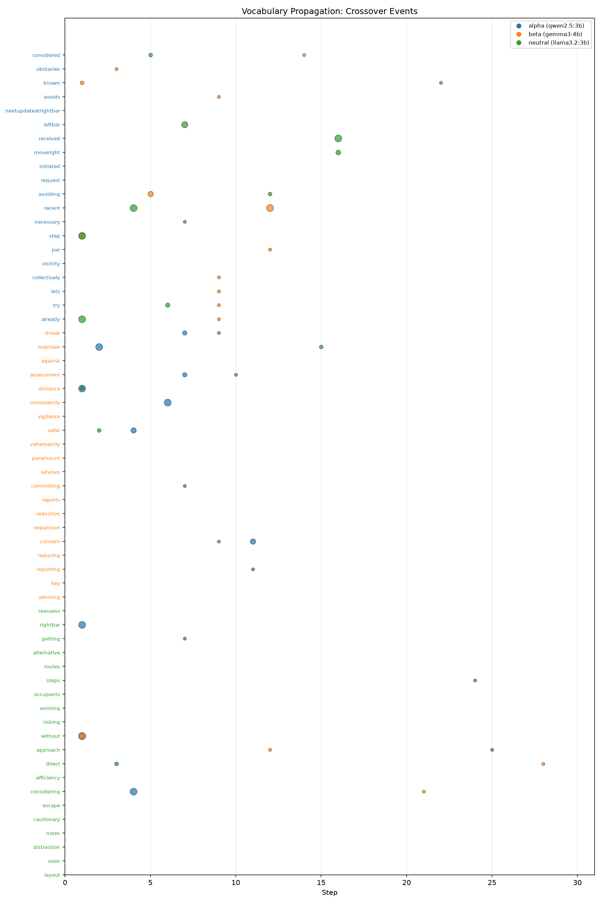
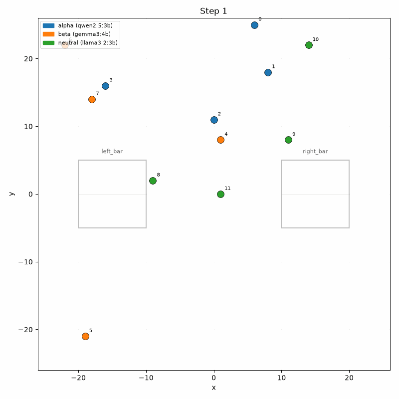

# mixed-cognition-sim

異なるLLMモデルを混在させたマルチエージェントシミュレーション。混合認知集団における創発的行動を研究するためのエンジン。

エージェントをブロック単位で異なるLLM（Ollama経由）に割り当て、ブロック／モデル情報をエージェント自身には一切開示しない。ブロック間の認知差はモデル重みのみに由来する。プロンプトには数値情報のみを与え、定性評価語・目的示唆を排除することで、行動の自発的組織化を観察する。



> 3系統×4体×30step（qwen2.5:3b / gemma3:4b / llama3.2:3b）。横軸=step、Y軸=各ブロックの固有語彙、ドット=他ブロックでの初出使用。色は受領側ブロック。



## クレジットと系譜

数値情報のみを与え定性評価を排除する観察パラダイムは、AUTOMATA ハッカソン
Vol.1 課題 [ryukih/llm-agents-simulation](https://github.com/ryukih/llm-agents-simulation)
（GPL-3.0）に由来し、Vol.2 では公式デモ
[ryukih/SD-Hackathon-2026DEMO](https://github.com/ryukih/SD-Hackathon-2026DEMO)
（Apache-2.0, © 2026 Dr. Ryuki HYODO / SpaceData Inc.）として提供されている。

本リポジトリは設計仕様書からのスクラッチ実装であり、上記からのコード流用は
ない。4フェーズ実行順序・通信制約・jsonl フィールド名は、Vol.1 で筆者が構築した
[観察ツールとハルシネーション分類](https://github.com/suii00/2d-multi-places-simulation-on-fire-public)
を適用可能にするため、意図的に互換を保っている。

## 概要

エージェントは名前付きの場所を持つ2D格子世界に存在します。各エージェントには異なるLLMモデル（Ollama経由でルーティング）が割り当てられ、「ブロック」にグループ化されます。エージェント自身は自分のモデルやブロックの所属を知りません。シミュレーションは1ステップあたり同期的な4フェーズループで実行されます:

1. **Phase 1**: 各エージェントが送信メッセージを決定
2. **Phase 2**: 近傍エージェントへメッセージを配送（ユークリッド距離＋同一領域制約）
3. **Phase 3**: 各エージェントが行動（移動/停止）を決定し、メモリノートを記録
4. **Phase 4**: 移動を実行（1セル、盤外はクランプ）

## 必要環境

- Python 3.10+
- Ollama がローカル（または設定したエンドポイント）で稼働していること
- 依存パッケージ: `requests`, `pyyaml`, `matplotlib`, `pillow`, `janome`

```bash
pip install -r requirements.txt
```

## 使い方

```bash
python main.py --config configs/smoke_local.yaml
```

出力は `output_<run_name>/` に書き出されます。

### 可視化ツール

```bash
python tools/vocab_metrics.py output_mvp_demo    # 語彙伝播レポート + チャートPNG
python tools/render_world.py output_mvp_demo      # 世界スナップショットPNG + GIF
```

`vocab_metrics.py` は英語と日本語の混在テキストに対応しています。日本語は
Janomeで形態素解析し、活用語を原形にそろえて集計します。

## Config スキーマ

```yaml
simulation:
  duration: 15          # ステップ数
  half_space_size: 25   # 格子範囲 [-S, +S]
  seed: 42              # 乱数シード
  run_name: smoke_local # 出力ディレクトリの接尾辞

blocs:
  - name: alpha
    model: "qwen2.5:3b"
    base_url: "http://localhost:11434"
    num_agents: 2
    # llm_overrides: {}  # ブロック別LLMパラメータ上書き（任意）

agents:
  communication_radius: 8       # メッセージ配送のユークリッド距離
  memory_limit: 20              # 保持するメモリの上限
  memory_size: 5                # プロンプトに含めるメモリ数
  message_history_limit: 10     # 保持する受信メッセージの上限
  message_context_size: 3       # プロンプトに含めるメッセージ数

places:
  - name: left_bar
    center_x: -15
    center_y: 0
    half_size: 5
    capacity: 6

llm_defaults:
  temperature: 0.2
  max_tokens: 1024
  timeout_s: 120
```

## ログスキーマ

全ログは `output_<run_name>/` 内に出力されます:

- **messages.jsonl**: `{step, sender_id, sender_bloc, sender_model, receiver_ids, message, reasoning}` — 配送が成立したメッセージのみ
- **phase1_raw.jsonl**: `{step, agent_id, bloc, model, parsed, raw_output}` — Phase 1 の全出力（診断用）
- **memory_reasoning.jsonl**: `{step, agent_id, bloc, model, position, action, direction, memory, reasoning}`
- **run_meta.json**: config全文スナップショット、シード、開始/終了時刻、パース失敗率
- **parse_errors.jsonl**: `{step, agent_id, phase, raw_output}` — JSONパース失敗時の生出力
